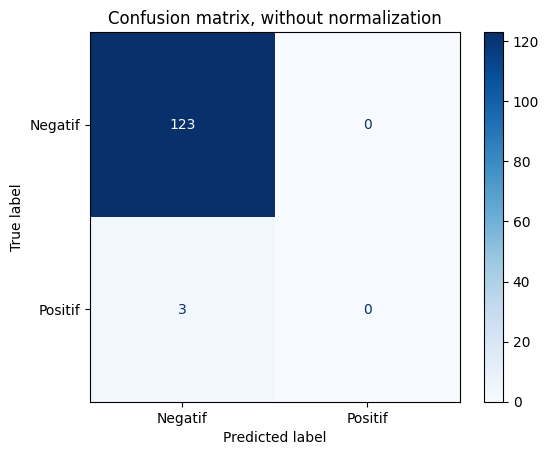
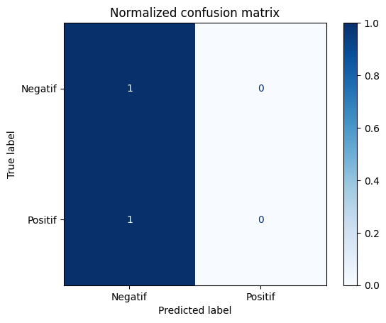

# Analisis Sentimen Masyarakat Pada Sosial Media Twitter Terhadap Gibran Rakabuming Sebagai Calon Wakil Presiden 2024

Proyek ini melakukan analisis sentimen terhadap tweet-tweet yang menyebutkan Gibran Rakabuming sebagai calon Wakil Presiden Indonesia tahun 2024. Analisis ini menggunakan teknik pemrosesan bahasa alami dan machine learning untuk mengklasifikasikan sentimen tweet sebagai positif atau negatif.

## Tangkapan Layar

Berikut adalah Confusion Matrix dari hasil analisis sentimen:

### Confusion Matrix Tanpa Normalisasi


### Confusion Matrix Ter-normalisasi


## Fitur-Fitur

- Preprocessing data teks dari tweet
- Analisis sentimen menggunakan TextBlob
- Pembagian dataset menjadi data latih dan data uji
- Penerapan TF-IDF untuk ekstraksi fitur
- Klasifikasi menggunakan Naive Bayes
- Evaluasi model dengan Confusion Matrix

## Penggunaan

1. Buka Google Colab (https://colab.research.google.com/).
2. Unggah file data tweet (sentiment_prabowo&gibran.csv) ke sesi Colab Anda.
3. Jalankan satu per satu sel kode

## Instalasi

1. Clone repositori ini:
   ```sh
   git clone https://github.com/v1nusss/sentiment-analysis.git
